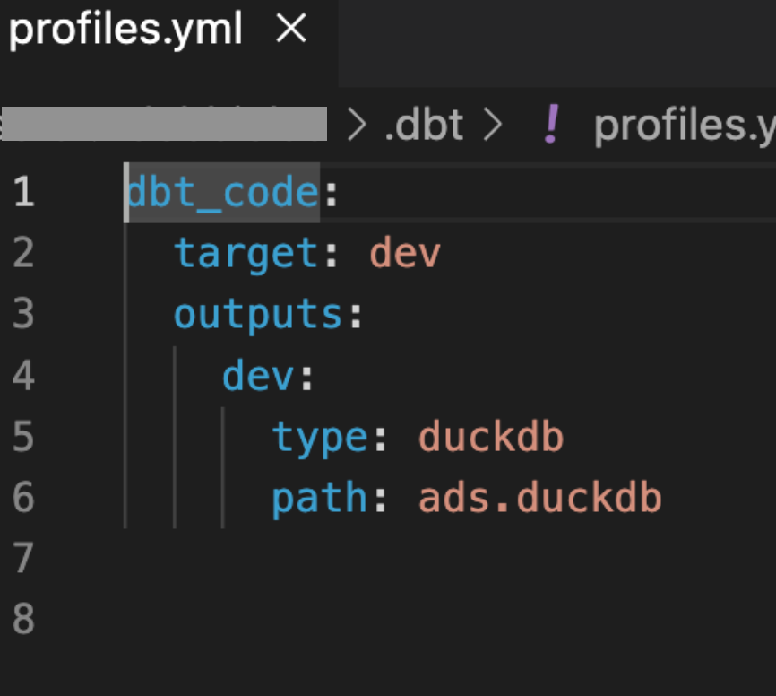

# Data transformation with dbt

## What is dbt? 📝

dbt provides two products: dbt Cloud and dbt Core. Both are data transformation tools. dbt Cloud is a commercial product to deploy dbt projects, while dbt Core is an open-source tool for local development of dbt projects. 

> [!NOTE]
>We will be working with dbt Core in this course. For simplicity, we will use the term *dbt* to refer to dbt Core.

dbt is used for transforming data from staging to transformed layers in data warehouse. Often, the layers can be schemas or databases. We will be using schemas as layers. 

> [!TIP] 
>💡Why using dbt for data transformation?
>- code execution is pushed to the data warehouse, taking advantage of its processing power instead of local computing
>- there is a broad selection for materialization: tables, views and incremental model etc
>- a dbt model is just a simple SELECT statement to define the resulting data  
>- dbt automatically determines execution order based on model dependencies
>- dbt auto-generates a visual documentation of how data flows through a pipeline: [lineage](https://www.getdbt.com/blog/getting-started-with-data-lineage)
>- Jinja templating is used for producing dynamic and reusable SQL codes(models)
>- data testing can be easily customized
>- etc

Video on what is dbt :point_down: 
[](https://www.youtube.com/watch?v=46-Xwx0NhlY)


## Installation 🛠️

In your uv virtual environment, install dbt along with duckdb adapter

```bash
uv pip install dbt-core dbt-duckdb
```

## Set up dbt project 💻

#### Step 1: set up project structure

On command line, initiate a dbt project called, for example, *dbt_code*

```bash 
dbt init dbt_code
```
This will produce 
- a folder with default subfolders and files called *dbt_code* in your working directory, which sets up the project structure for your dbt project
- a yaml file called ```profiles.yml``` in a folder ```.dbt``` in your home directory: ```~/.dbt/```

##### Step 2: copy an existing duckdb file to your dbt project

For instance, use the *ads.duckdb* created in previous lectures as the data warehouse with staging layer

##### Step 3: configure connection to data warehouse

The `profiles.yml` file store connection settings to data warehouse. Update the file as below for dbt to point to *ads.duckdb* in the working directory: 



Check the connection to data warehouse with the syntax below:

```
dbt debug
```
🚀 If the connection is successfully, you are ready to develop your dbt models that transform data from staging to transformed layers in your chosen data warehouse! 

Video on setup dbt in vscode :point_down: 
[](https://www.youtube.com/watch?v=7I6Xv423aGw)

## Overview of a dbt project 
<!--update this-->
 
| directory/file      | details                                                                              |
| ------------------- | ------------------------------------------------------------------------------------ |
| dbt_project.yml     | main config file for the dbt project with project specific settings                  |
| ~/.dbt/profiles.yml | connection configs for different environments, connect dbt to data warehouse         |
| models              | sql files that define the models for data transformations                            |
| schema.yml          | used for defining tests, documentations, relationships for models, seeds and sources |
| seeds               | contains csv files that can be loaded into data warehouse                            |
| snapshots           | define snapsoht files, useful for slowly changing dimensions (SCD)                   |
| macros              | reusable sql snippets (macros) to DRY up the sql code                                |
| analyses            | ad-hoc analyses for EDA, these files will not materialize as models                  |
| logs                | log files from execution of dbt commands                                             |
| target              | compiled sql code that dbt generates combining model files, macros and configs       |
| tests               | custom test definitions to validate data models for data quality and integrity       |
| docs                | markdown files to document dbt project, can be rendered in dbt documentation         |

## Try a small transformation 🧪 

Continue following the video above to do a small transformation. 

## Other videos :video_camera:

from Kahan data solutions 
- [Tips to improve your dbt projects](https://www.youtube.com/watch?v=qOx8l_QFz9I&list=PLy4OcwImJzBLJzLYxpxaPUmCWp8j1esvT&index=2)
- [Add raw sources to your dbt project](https://www.youtube.com/watch?v=Y03CsVDK69Y&list=PLy4OcwImJzBLJzLYxpxaPUmCWp8j1esvT&index=3)
- [Deploy to custom schemas & override dbt defaults](https://www.youtube.com/watch?v=AvrVQr5FHwk&list=PLy4OcwImJzBLJzLYxpxaPUmCWp8j1esvT&index=5)
- [Change the materialization (aka how dbt models deploy)](https://www.youtube.com/watch?v=zpACZu31154&list=PLy4OcwImJzBLJzLYxpxaPUmCWp8j1esvT&index=7)

## Read more :eyeglasses:

from dbt docs
- [What is dbt](https://www.getdbt.com/blog/what-exactly-is-dbt)
- [About dbt project](https://docs.getdbt.com/docs/build/projects)
- [dbt models](https://docs.getdbt.com/docs/build/models)
- [dbt seeds](https://docs.getdbt.com/docs/build/seeds)
- [Jinja and macros](https://docs.getdbt.com/docs/build/jinja-macros)
- [sources](https://docs.getdbt.com/docs/build/sources)
- [project variables](https://docs.getdbt.com/docs/build/project-variables)