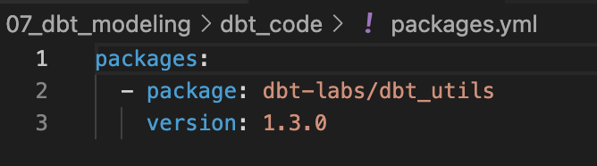

# Data transformation with dbt - a more realistic example
In this lecture, we will transform data with dbt according to a dimensional model which is usually provided to the data engineer team as the blueprint of coding dbt models. 

## Scenario 💡
Imagine you are a data engineer for a HR agency. Here's an overview of the business model of this agency: <br>

Talent acquisition specialists work with different occupation fields. According to the opening job ads on Arbetsförmedlingen, they will: 
  - search and contact potential candidates from LinkedIn
  - contact and market those potential candidates to corresponding employers <BR>

Therefore, they constantly analyze job ads in order to understand which types of candidates they should approach. Currently, every begining of the week, they manually browse the homepage of Arbetsförmedlingen and download a list of opening job ads to guide their work over the week. However, they are not able to draw insights from these job ads as: 
  - the information are messy 
  - they have spent too much time to manually collect and clean data so that they do not have much time to analyze the data, which is important to improve the efficiency of their work <BR>

Now, you are given a task to create a data pipeline for the team of talent acquisition specialists to: 
  - automate the data extraction from Jobtech API of Arbetsförmedlingen
  - transform and structure data according to a dimensional model
  - design a dashboard for talent acquisition specialists to analyse numbers of vacancies by city, by occupation and by employment types etc, for each of the occupation fields
  - etc... details of all requirements will be described in the tasks below
  - 
## Data modeling ⭐
In practice, the tables in the staging layer usually match the raw source data, but in the refined layer, we reorganize them into a new structure, like a **dimensional model**. A dimensional model is a way of organizing data into **facts** (numbers to measure, like sales or revenue) and **dimensions** (categories to filter or group by, like products, time, or locations) to make analysis easier. In this lecture, we will create dbt models according to the dimensional model below. Check out the slide `data_modeling_related_concepts.pdf` to refresh some related concepts for database design. 


We will not go through how a dimensional model is created. 

Here're some key concepts about dimensional model:

### Why dimensional model?

- It is intuitive and easy to understand because it organizes data around business concepts like facts (e.g., sales) and dimensions (e.g., products, customers).

- Querying in a dimensional model is faster because it's designed for aggregation and filtering, which are common in analytics.

- Helps users easily analyze data from different perspectives (e.g., revenue by region, product, or time) and uncover trends.

### What is star schema?
A star schema is a type of dimensional model that organizes data into a central fact table (which contains measurable data like sales or revenue) surrounded by dimension tables (which provide descriptive information like products, customers, or time). The "star" shape comes from how the fact table connects to multiple dimensions, making it simple and efficient for analysis.

## Preparing data warehouse 🛢️
Run the python script, `extract_load_api.py` provided for this lecture, to load raw data to the staging scheme of a duckdb data warehouse. This python script will load more job ads for three chosen occupation fields which are Education, Healthcare and IT. 


## Creating dbt models 🛠️
Before following the code along video below to create dbt models for the given data model, below're new concepts of dbt that will be used: 

>[!Note]
>You can only find parts of the scripts in this repo because they are just helping you to build the remain.

### source models 
Before building models for fact, dimenions and marts, we will source models will be created. The benefits are that in this way, source data can be tested and they will appear as dependencies in lineage. `source.yml` will be used to store information of these models. 

### surrogate key
When creating models for fact and dimensions, we need to consider the primary and foreign keys used later to link records between these models. Surrogae key is a new key created for this purpose. 

Alernatively, one can use natural keys which are data fields originally exist in raw data. There are different reasons for a certain choice between natural and surrogate keys. However, the bottom line is that the chosen key is the unique identifier of records in dimension tables. 

### dbt utils 
In the coding part, we showcase the use of a built-in dbt macro to create surrogate key, `generate_surrogate_key()`. In order to use this, one need to install `dbt-utils` package to the project. Follow these steps:

- Step 1: create `packages.yml` file as below under your project directory:

- Step 2: run the below dbt command to install the dependencies
  ```bash
  dbt deps
  ```

Video on dbt coding to transform data- part 1:point_down:

<a href="https://www.youtube.com/watch?v=cjNKTv8xsQA&list=PLpHkXU1Ab_H-Gdq3OG0eBlDZTHUT4q3Z8&index=3" target="_blank">
  
</a>

Video on dbt coding to transform data- part 2:point_down:

<a href="https://www.youtube.com/watch?v=h4DnfiW7Ums&list=PLpHkXU1Ab_H-Gdq3OG0eBlDZTHUT4q3Z8&index=2" target="_blank">
  
</a>

## Other videos :video_camera:

from Kahan data solutions 
- [Tips to improve your dbt projects](https://www.youtube.com/watch?v=qOx8l_QFz9I&list=PLy4OcwImJzBLJzLYxpxaPUmCWp8j1esvT&index=2)
- [Add raw sources to your dbt project](https://www.youtube.com/watch?v=Y03CsVDK69Y&list=PLy4OcwImJzBLJzLYxpxaPUmCWp8j1esvT&index=3)
- [Deploy to custom schemas & override dbt defaults](https://www.youtube.com/watch?v=AvrVQr5FHwk&list=PLy4OcwImJzBLJzLYxpxaPUmCWp8j1esvT&index=5)
- [Change the materialization (aka how dbt models deploy)](https://www.youtube.com/watch?v=zpACZu31154&list=PLy4OcwImJzBLJzLYxpxaPUmCWp8j1esvT&index=7)

## Read more :eyeglasses:
dbt from dbt docs
- [dbt models](https://docs.getdbt.com/docs/build/models)
- [dbt seeds](https://docs.getdbt.com/docs/build/seeds)
- [Jinja and macros](https://docs.getdbt.com/docs/build/jinja-macros)
- [sources](https://docs.getdbt.com/docs/build/sources)
- [project variables](https://docs.getdbt.com/docs/build/project-variables)